# 10. Routes

Praktikum – Bagian 1: Configure the routes
---

* Buat project baru yang berisi komponen posts (praktikum http service), form-member (soal uts), navbar, not-found, home

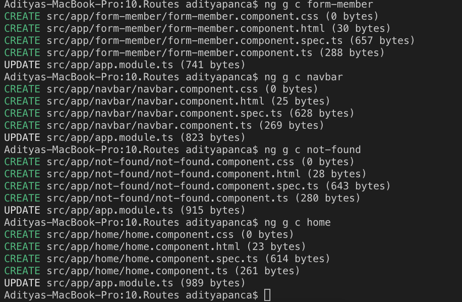

* Buka file app.module.ts. Pastikan komponen pada langkah 1 sudah terdaftar seperti gambar dibawah ini

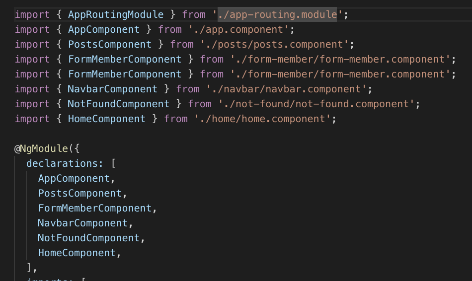

* Tambahkan module router pada halaman app.module.ts seperti gambar dibawah ini:

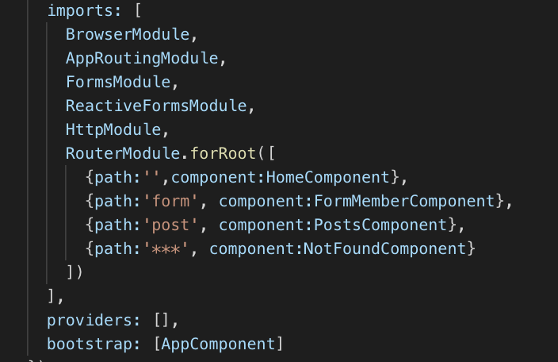

* Buka halaman navbar.component.html dan tambahkan kode dibawah ini:

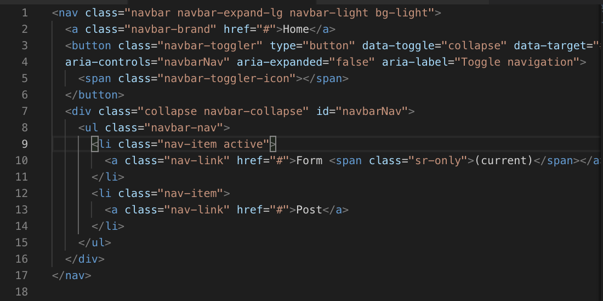

* Buka halaman app.component.html. tambahkan kode dibawah ini:

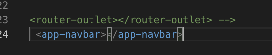

* hasilnya 

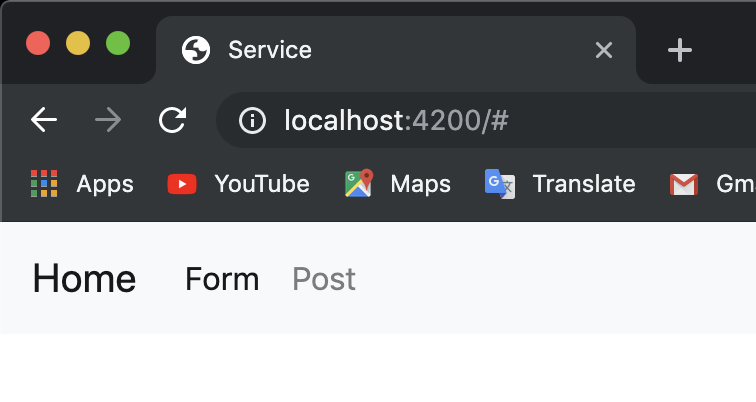

Praktikum - Bagian 2 : Router Outlet
---

* Buka halaman app.component.html dan rubah menjadi seperti dibawah ini:

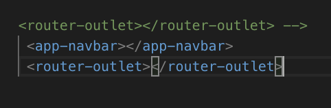

* Jalankan dan inspect elemen seperti pada gambar dibawah ini

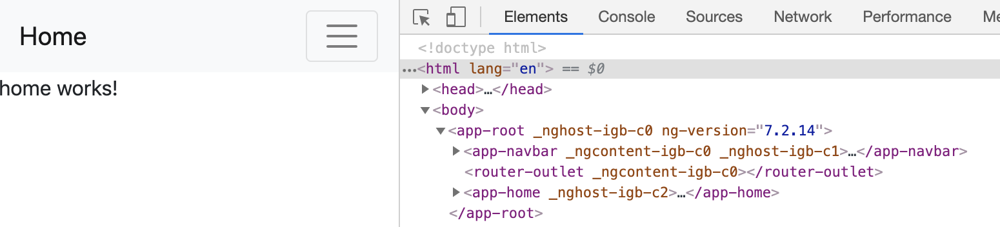

* Jalankan link dibawah ini localhost:4200/form seperti gambar dibawah ini:

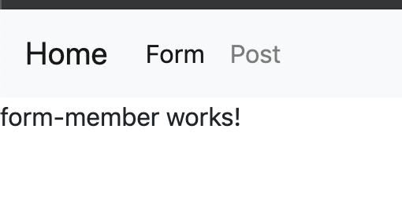

* Jalankan link dibawah ini localhost:4200/post seperti gambar dibawah ini:

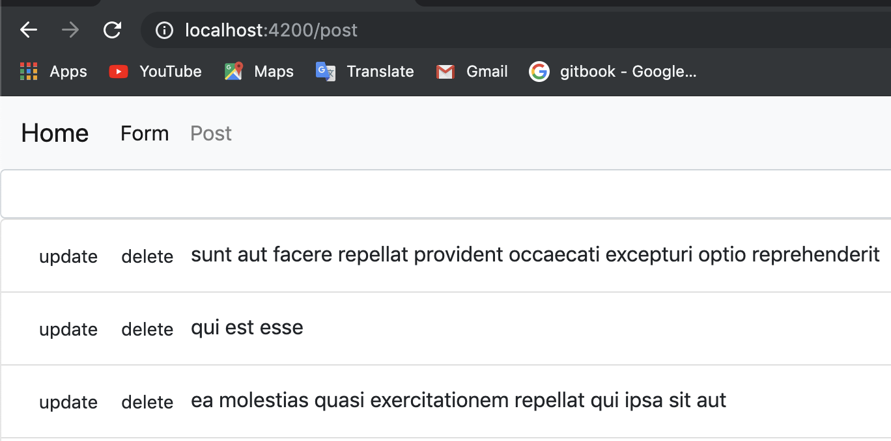

* Jalankan link dibawah ini localhost:4200/coba seperti gambar dibawah ini:

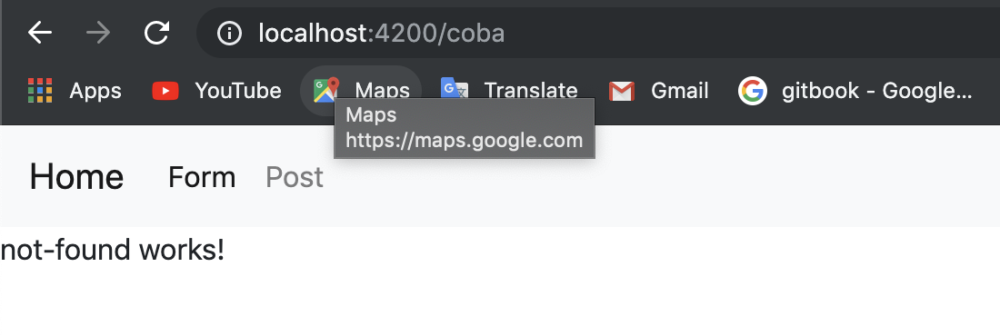

Praktikum - Bagian 3 : Add Link
----

* Buka halaman navbar.component.html. tambahkan link pada href tiap menu seperti gambar dibawah ini:
 
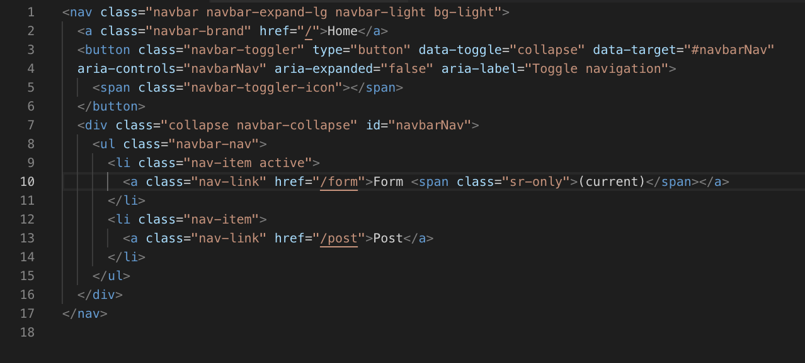

* hasilnya

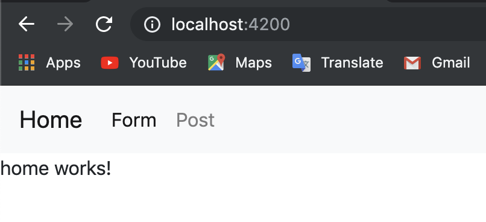

* Modifikasi href menjadi routerLink pada halaman navbar.component.html seperti gambar dibawah ini

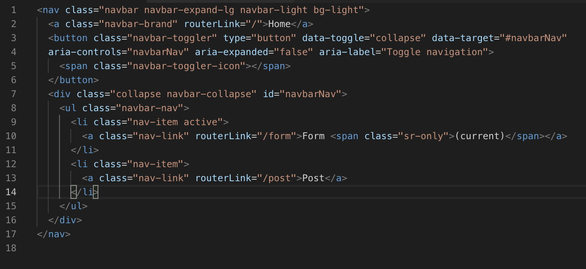

* hasilnya 

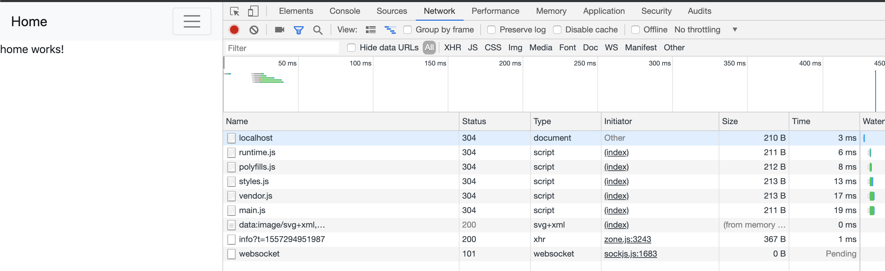

* Modifikasi class li pada halaman navbar.component.html menjadi seperti pada gambar dibawah ini:
 
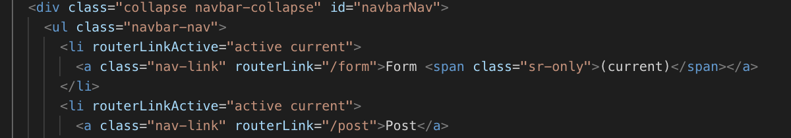

* hasilnya 

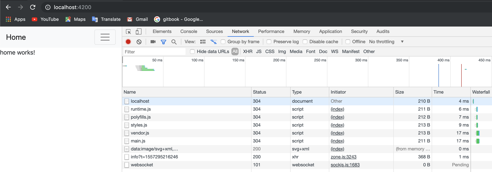

Praktikum - Bagian 4 : Accesing Route Parameter
---

* Buka app.module.ts dan tambahkan route untuk profile seperti gambar dibawah ini:

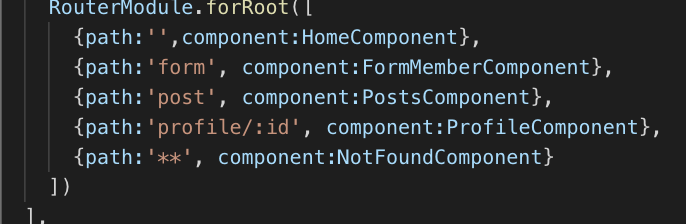

* Modifikasi halaman home.component.html menjadi seperti gambar dibawah ini:

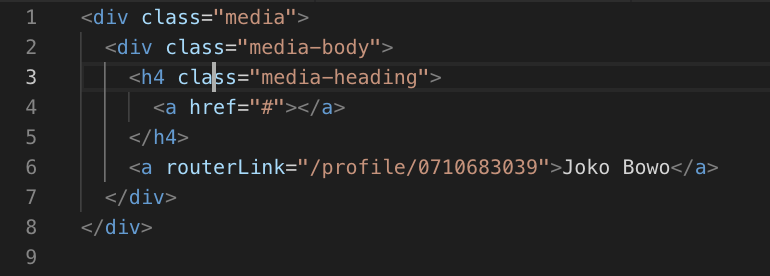

* Modifikasi file profile.component.ts menjadi seperti pada gambar dibawah ini:

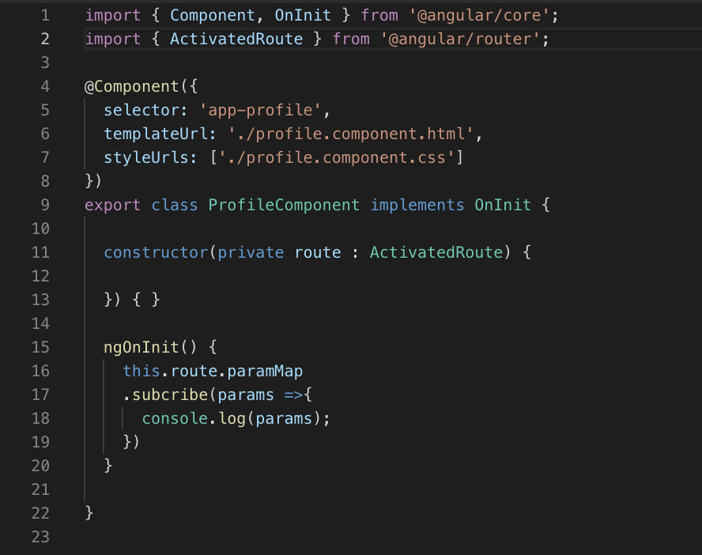

* Jalankan, klik tombol home kemudian kliklink joko bowo kemudia inspect element seperti dibawah ini:

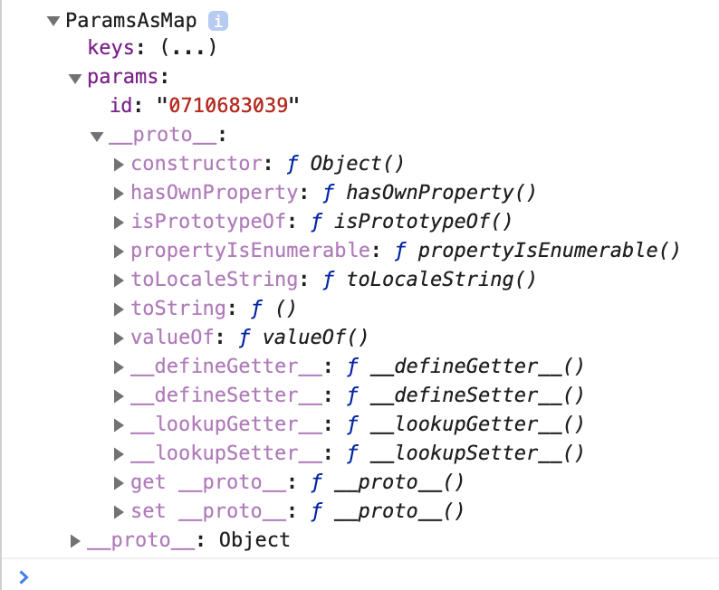

* Modifikasi file profile.component.ts menjadi seperti pada gambar dibawah ini:

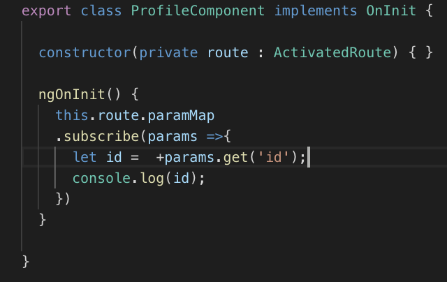

* Jalankan, klik tombol home kemudian klik link joko bowo kemudia inspect element. Catat dan berikan penjelasan (Soaln No. 11)

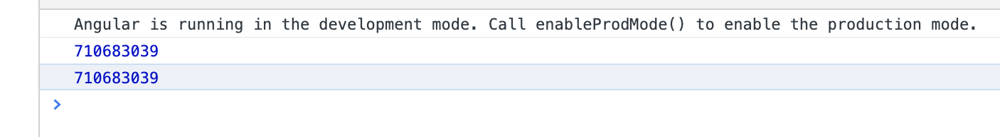
