# 6. Directive

Praktikum – Bagian 6.1: ngIf
---

* buka file

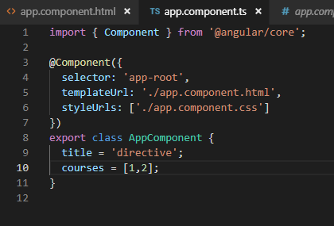

* buka file

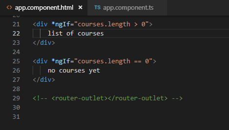

* hasilnya

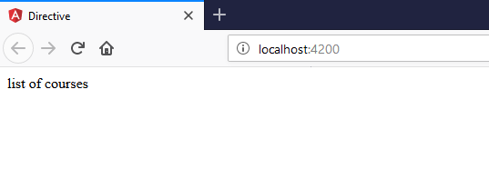

* buka file app.component.html modifikasi kodenya menjadi berikut
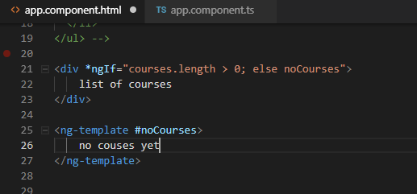

* jalankan localhost dengan kondisi array pada app.component o dengan array kosong

.PNG)

* hasilnya

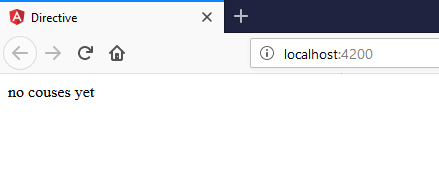

* dengan array ada isi

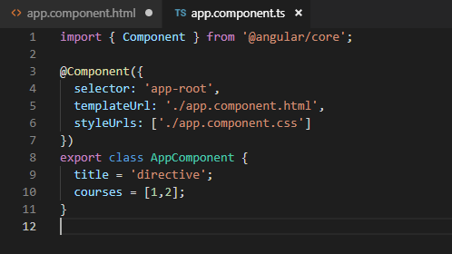

* hasilnya

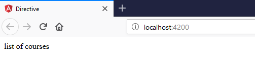

* buka file app.component.html modifikasi kode nya menjadi berikut

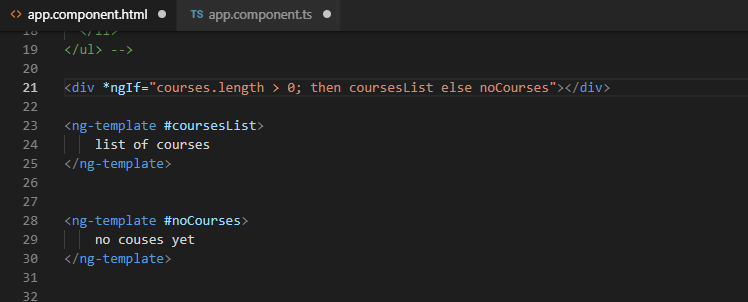

* jalankan dengan array kosong

.PNG)

* hasilnya 

* dengan array ada isi

* hasilnya

Praktikum – Bagian 6.1: HIdden Property
---

* buka app.component.html

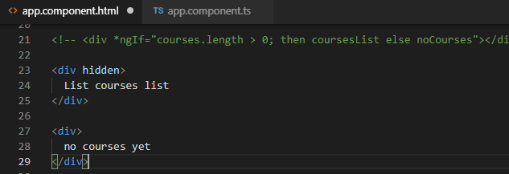

* hasilnya

* selain contoh diatas kita juga dapat memberikan property seperti berikut

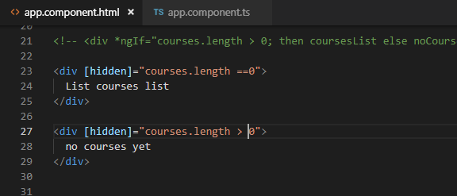

* hasilnya 

* Jika kita inspect element maka akan terlihat property hidden tidak terdapat kondisi true ataupun false

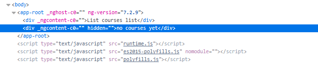

* berbeda jika kita menggunakan ngIF terdapat bindings dengan nilai false 

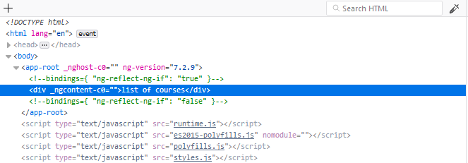

Praktikum – Bagian 6.1: ngSwitch Case
---

* buka file app.component.html modifikasi codenya menjadi seperti berikut 

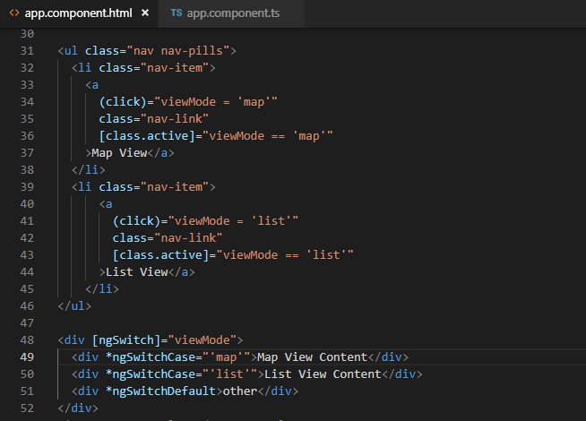

* buka file app.component.ts tambahkan property viewMode (line 12) 

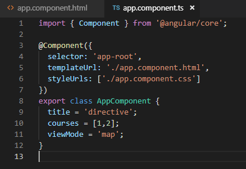

Praktikum – Bagian 6.1: ngFor
---

* buka app.component.ts property CoursesFor yang berisikan array

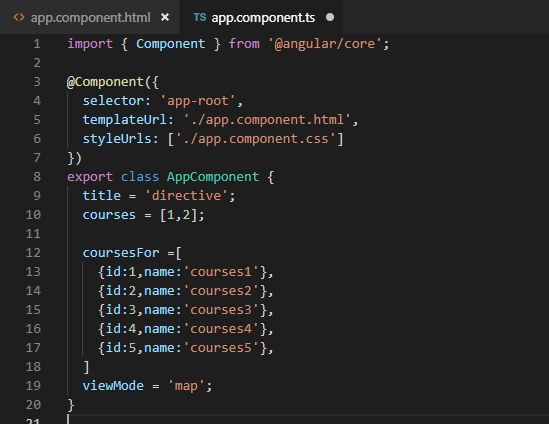

* hasilnya 

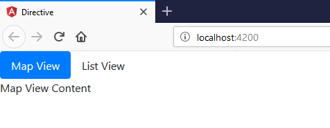

* modifikasi code

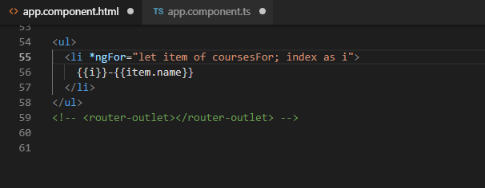

* hasilnya

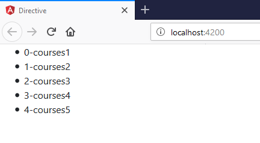

* kita juga dapat memberi tanda tertentu pada index yang bernilai ganjil dengan menggunakan isEven 

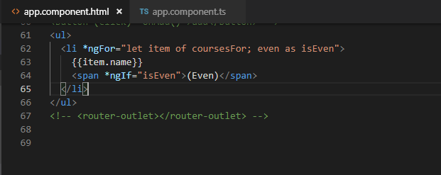

* hasilnya

Praktikum – Bagian 6.1: ngFor dan Detection
---

* modifikasi code

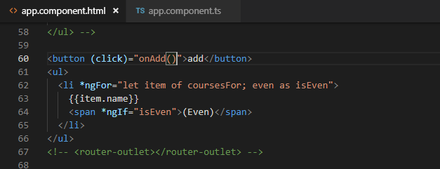
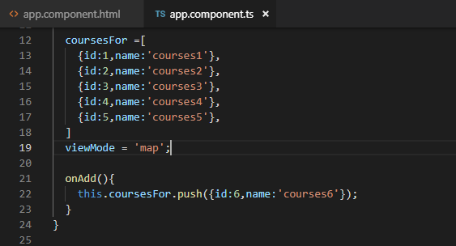

* hasilnya

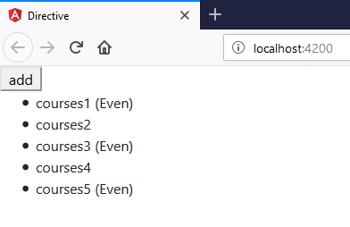
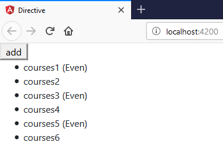

* Buka app.component.html dan tambahkan sebuah button untuk menghapus

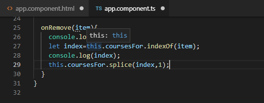

* hasil inspect

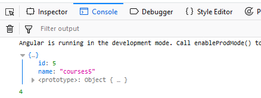

* modifikasi code

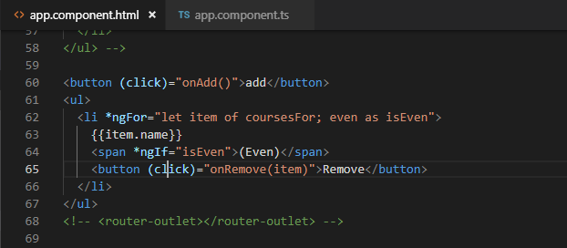

* hasilnya

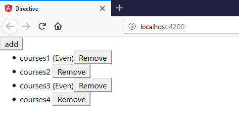

* buka file app.component.html tambahkan button

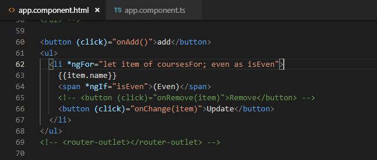

* buka file app.component.ts buatlah sebuah method onChange dengan parameter 

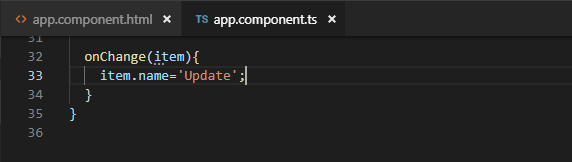

* hasilnya

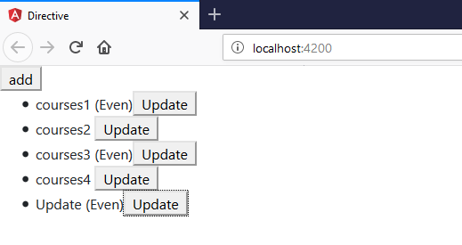

Praktikum – Bagian 6.1: ngFor dan trackby
---

* Buka file app.component.ts buatlah sebuah method dengan nama loadCourses (line 38) tapi sebelumnya buat sebuah property dengan nama coursesForOne

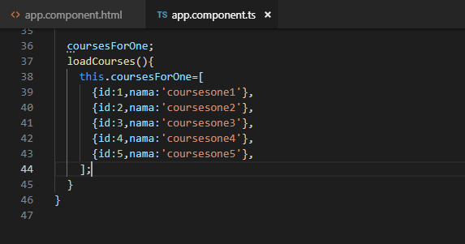

* buka file app.component.html dan tambahkan code seperti pada gambar 

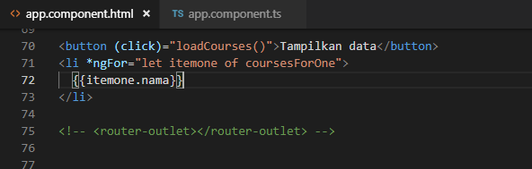

* buka file app.component.html dan tambahkan code seperti pada gambar 

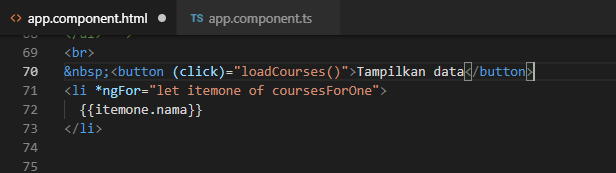

* hasilnya

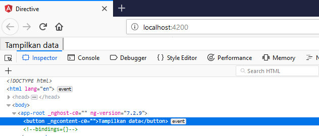
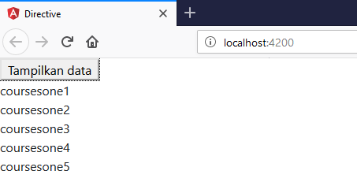

* menghilangkan duplicate di inspect

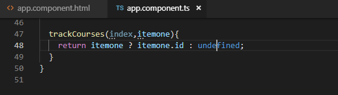

Praktikum – Bagian 6.1: The Leading Asterick
---

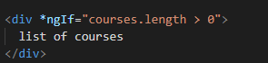
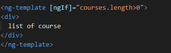

Praktikum – Bagian 6.1: ngClass
---

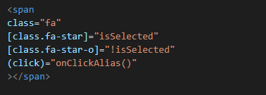
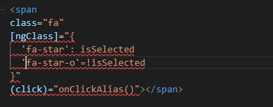

Praktikum – Bagian 6.1: Custom Directive
---

* pertama kita harus membuat directive dengan nama input-format terlebih dahulu dengan perintah seperti berikut

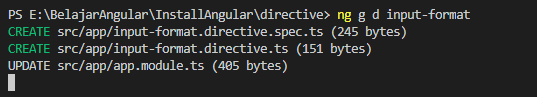

* jika directive berhasil digenerate maka kita pastikan di app.module.ts pada
@NgModule terdapat nama directive yang kita buat tadi

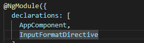

* buka input-format.directive.ts dan tambahkan decorator HostListener seperti pada gambar berikut

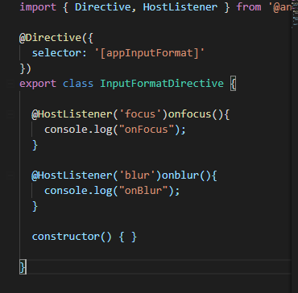

* Buka file app.component.html dan tambahakn code berikut

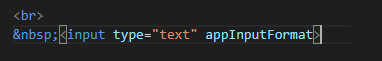

* hasilnya

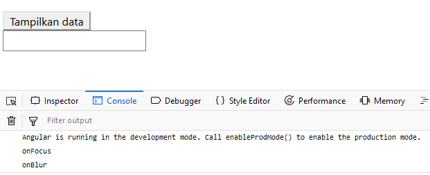

* buka file input-format.directive.ts dan modifikasi codenya menjadi berikut

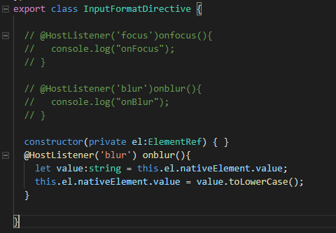

* hasilnya 

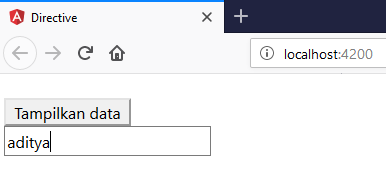

* buka file app.component.html dan tambahkan property binding dengan nama
format

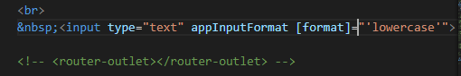

* buka file input-format.directive.ts tambahkan decorator input dan modifikasi codenya seperti pada gambar berikut

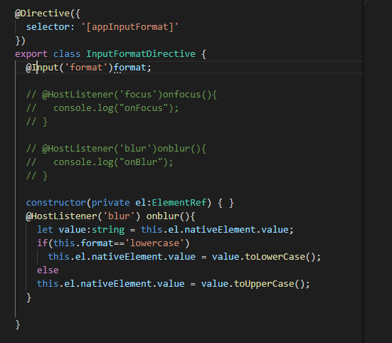

* hasilnya

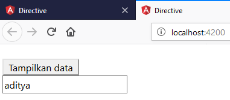

* buka app.component.hml modifikasi codenya menjadi berikut

* buka input-format.directive.ts dan tambahkan decorator input dengan parameter appInputFormat

* hasilnya

