# 9. HTTPservice

Praktikum – Bagian 1: JSONPlaceHolder
---

* Pada bagian ini kita akan menggunakan fake HTTP Service yang akan kita gunakan sebagai back end aplikasi kita. Kunjungi alamat berikut : http://jsonplaceholder.typicode.com/
Jika Anda scroll down maka Anda akan menemukan bagian Resources seperti pada gambar 2 berikut :

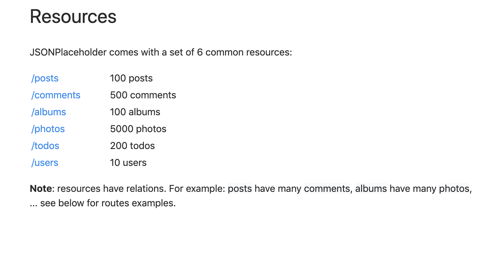

Praktikum - Bagian 2 : Getting Data
---

* Buat component baru dengan nama posts dengan perintah ng g c posts

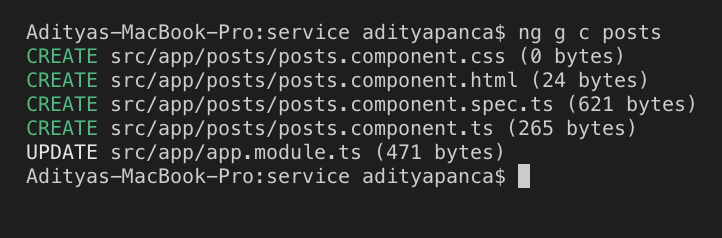

* Untuk menggunakan HTTPService, kita perlu melakukan import HttpModule pada app.module.ts.

* Setelah kita menambahkan HttpModule pada bagian imports, maka secara otomatis akan menambah imports pada bagian paling atas 

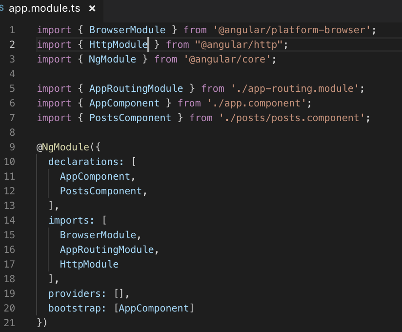

* Jika HttpModule tidak muncul secara otomatis maka anda harus menginstal terlebih dahulu dengan perintah npm i @angular/http 

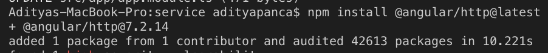

* Modifikasi file posts.component.ts menjadi seperti berikut:

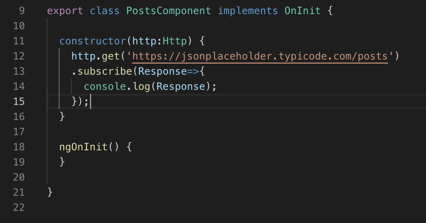

* Jalankan dan Catat hasilnya (soal 1)

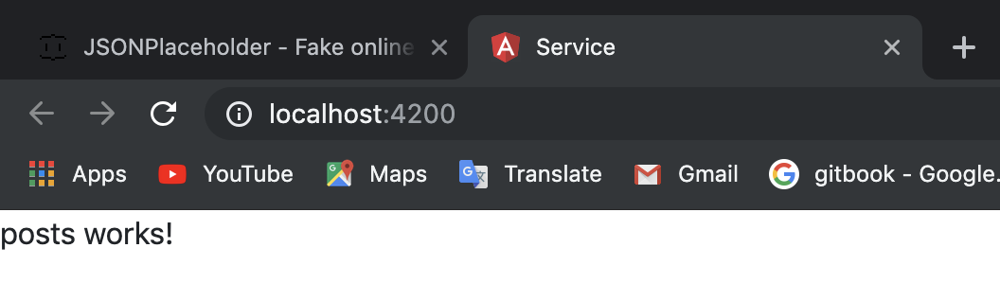

* Bagaimana jika anda lupa melakukan import HttpModule pada langkah ke-2 ? Lakukan commenting pada HttpModule seperti pada kode berikut :

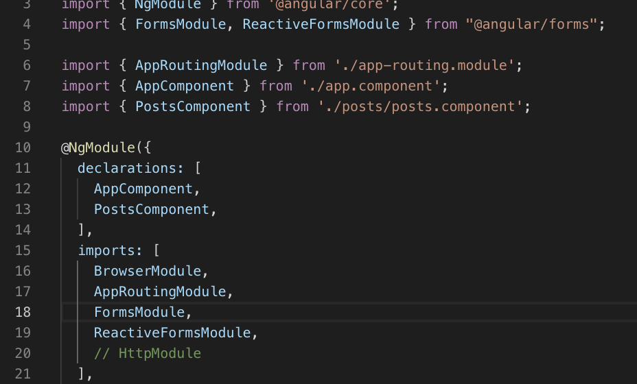

* Apa yang terjadi pada console? Berikan penjelasan atas error yang terjadi. (soal 2)

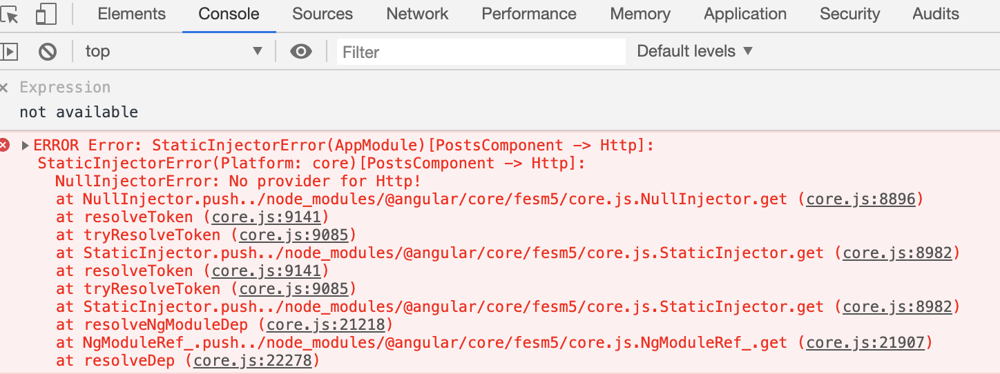

* Lengkapi kode program pada posts.component.ts menjadi :

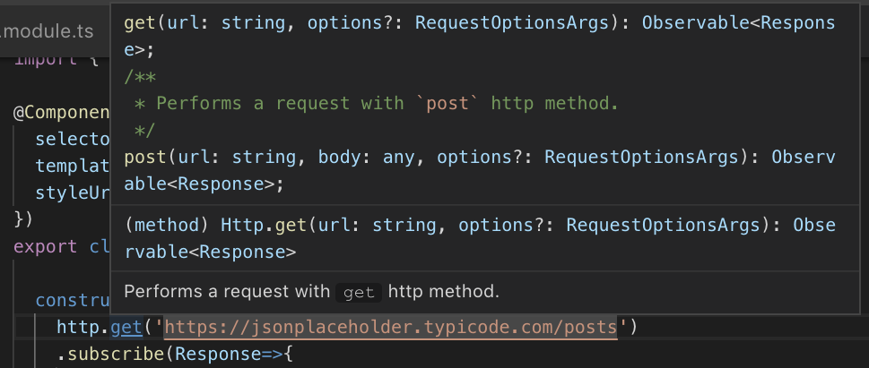

* Jalankan pada browser dan jelaskan yang muncul pada console. (soal 3)

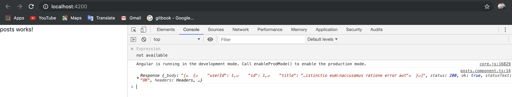

* Jelaskan perbedaan yang terjadi pada console jika kode pada posts.component.ts diubah menjadi : (soal 4)

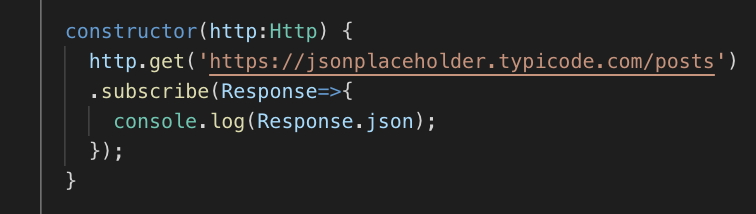

* Untuk menampilkan data pada halaman browser, ubah kode program pada posts.component.html seperti berikut :

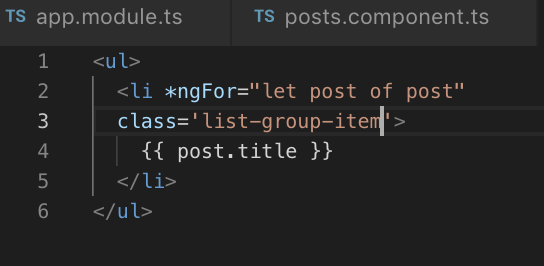

* Ubah kode program pada posts.component.ts :

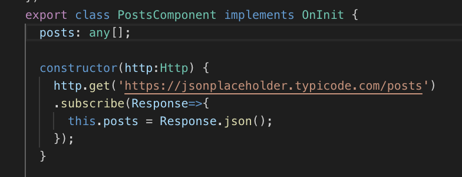

* Jalankan dan jelaskan apa yang muncul pada browser. (soal 5)

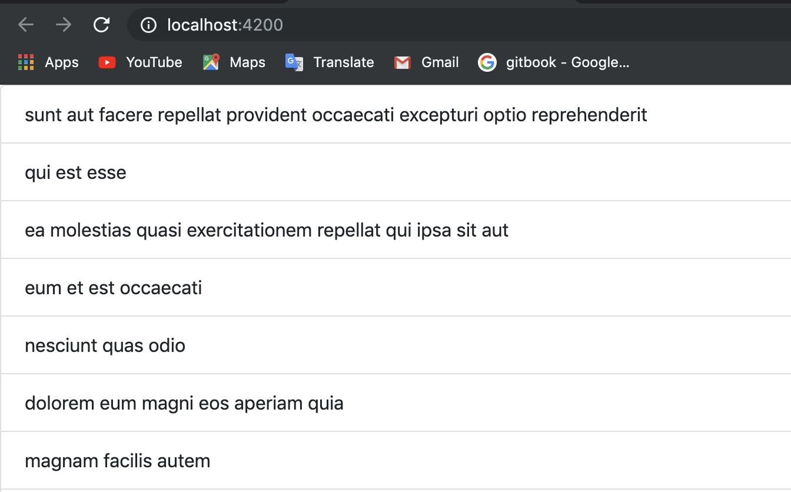

Praktikum - Bagian 3 : Creating Data
---

*  Kita akan menambahkan sebuah text area untuk memasukkan data melalui browser, seperti gambar berikut :

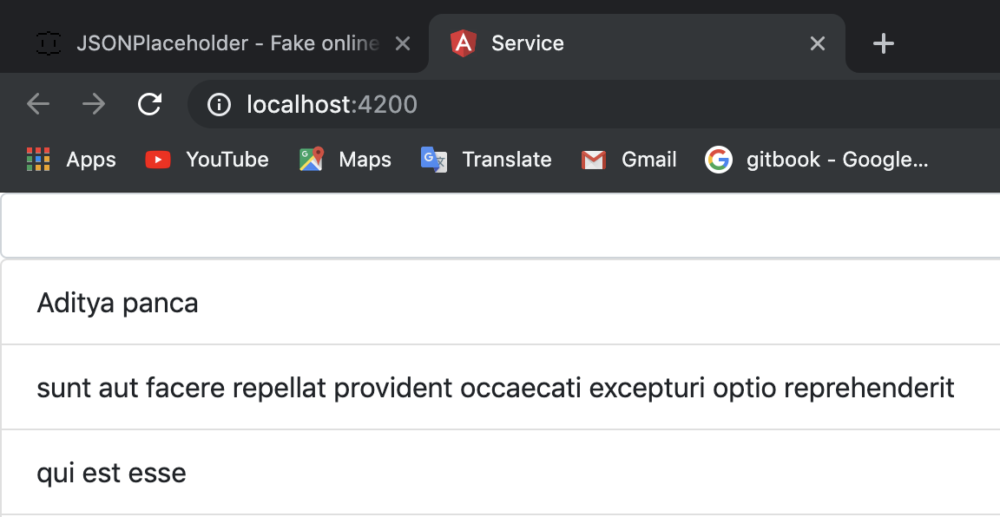

* Pertama, tambahkan input elemen pada posts.component.html :

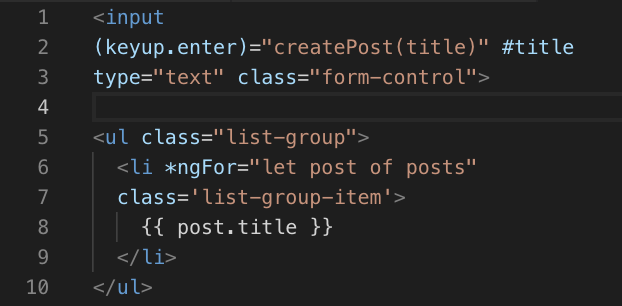

* Modifikasi kode program pada posts.component.ts 

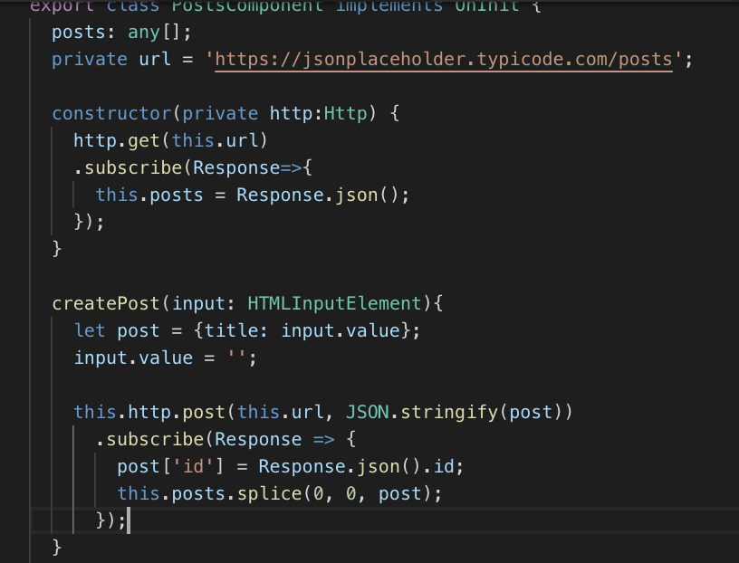

* jalankan browsernya 

Praktikum - Bagian 4 : Updating Data
---

* Tambahkan button Update dengan modifikasi kode program seperti di bawah ini :

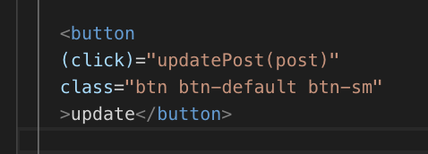

* Tambahkan fungsi updatePost pada posts.ts seperti di bawah :

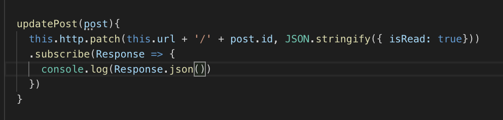

* hasilnya

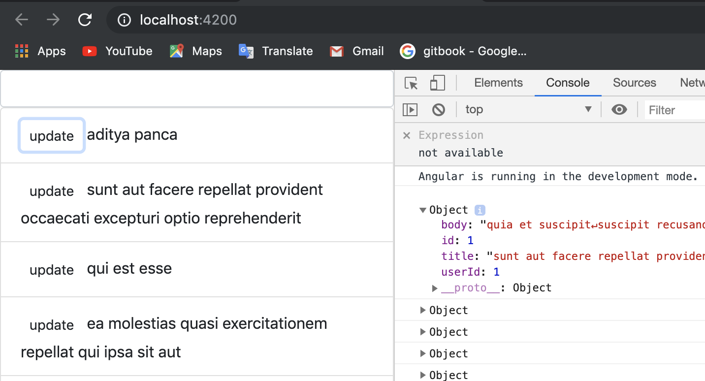 

* Tambahkan button Delete dengan modifikasi kode program seperti di bawah ini :

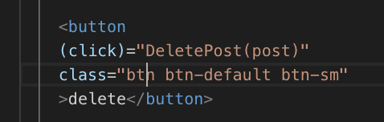

* Tambahkan fungsi deletePost pada posts.ts seperti di bawah :

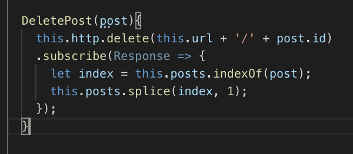

* hasilnya

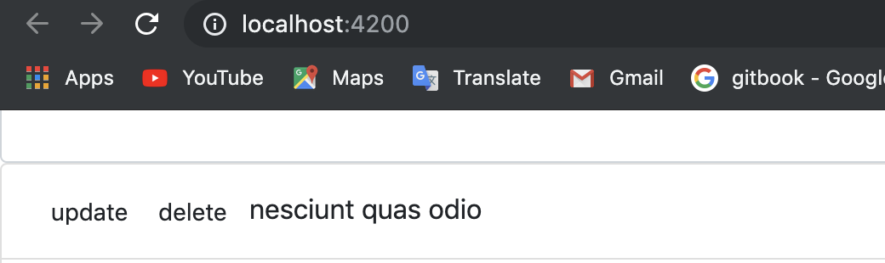
